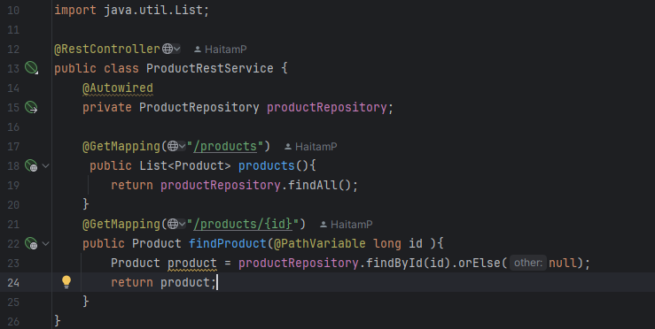
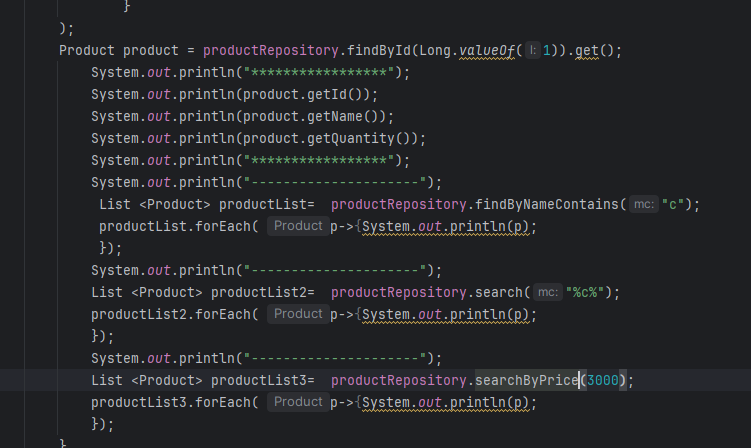
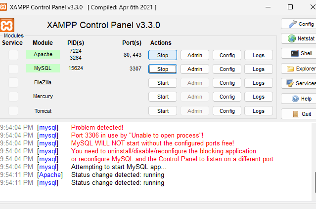
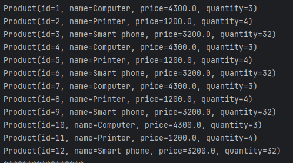
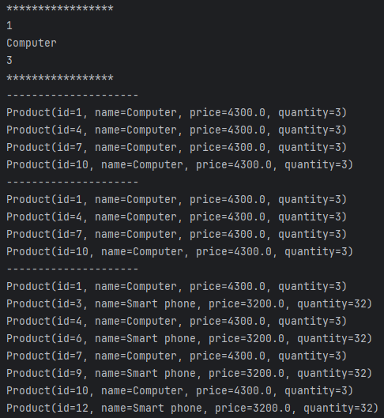
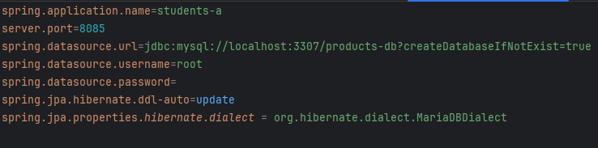
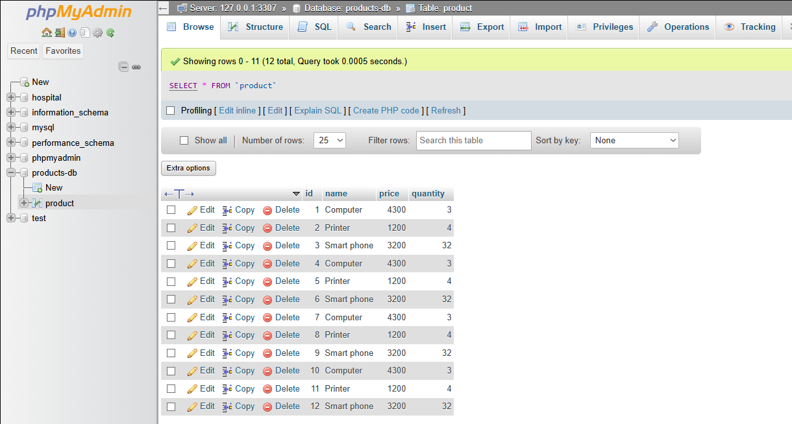
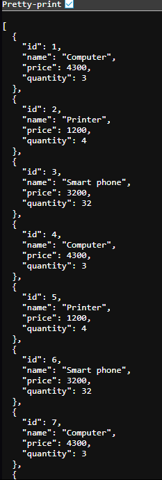
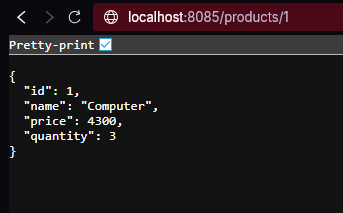

<h2>first spring boot App</h2>

<h2>repository methode in use</h2>

<h2>repository queries</h2>

<h2>XAMPP control panel</h2>

<h2>product list</h2>

<h2>queries executed</h2>

<h2>port + mysql creation</h2>

<h2>product list in the database</h2>

<h2>product list in 8085/products</h2>

<h2>product by id</h2>
